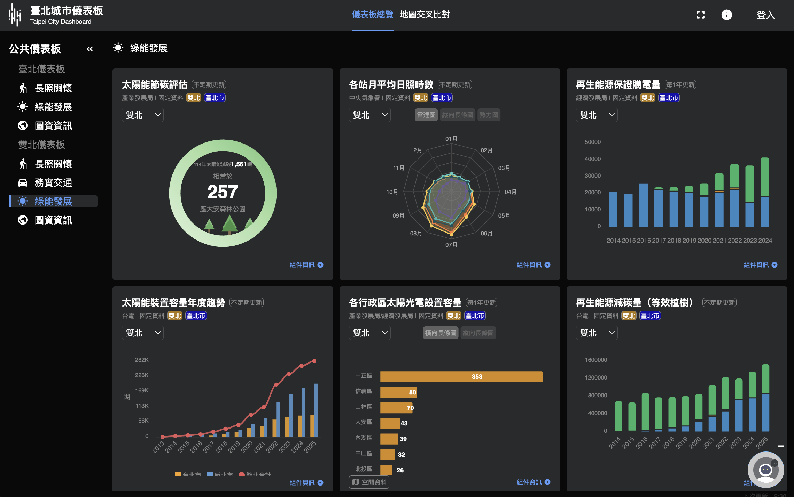
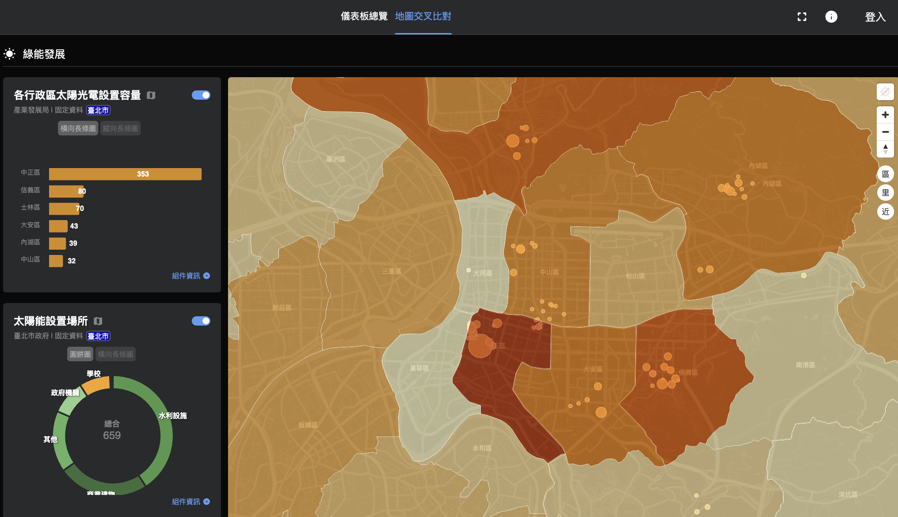
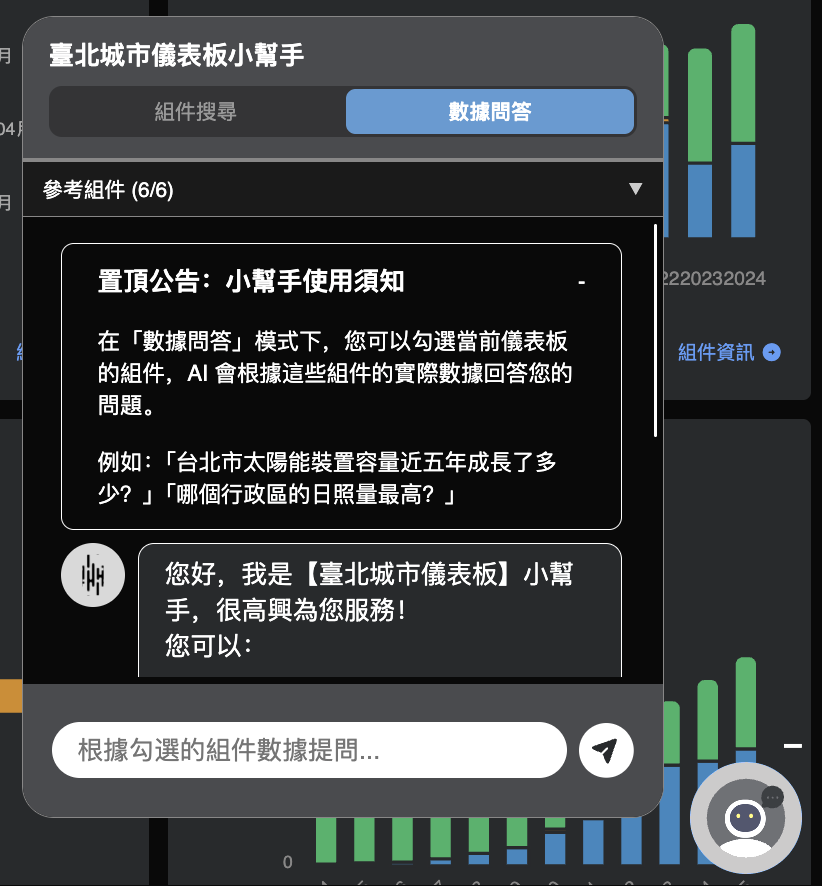

# 研發科連發部-雙北城市儀表板（永續環境）
## 簡述提案方向與內容

面對全球永續發展挑戰，我們以雙北城市儀表板為基礎，整合台北市資料大平台、新北市經濟發展局、中央氣象署、台電、經濟部能源署等多元資料來源，從日照潛力、裝置容量、碳減排成效、行政區分布、再生能源躉購五個維度，完整呈現雙北太陽能發展全貌。而針對儀表板服務兩大族群：政府單位可掌握各區進展、對標政策目標、調整補助策略；一般市民則能理解城市綠能現況，將抽象的碳排數字化為可視覺化、貼近生活與易於理解的儀表板內容。

## 組件介紹

### 組件一：各測站月平均日照時數

1. 組件說明：本組件呈現臺北市與新北市主要氣象測站之月平均日照總時數統計資料，涵蓋全年各時段之日照變化情形。圖表橫軸為月份，縱軸為日照總時數（小時），並結合雷達圖、縱向長條圖與熱力圖等多元視覺形式，呈現不同測站於各月份之日照分布狀況。資料內容包含板橋、淡水、竹子湖、臺北及鞍部等測站，反映都市內部不同條件下之日照差異。透過雷達圖之同框呈現，可直觀比較各測站全年日照結構與季節變化，進一步揭示區域間之差異特性。此資料可作為評估雙北地區太陽能發展潛力之重要依據，並可支援政府於再生能源設置地點選擇、資源配置及投資決策之規劃參考。資料具備完整性與時間連續性，適合用於進行跨區域與跨時序之比較分析。

2. 範例情境：
本組件之應用可延伸至再生能源規劃與實務決策之情境，透過各測站月平均日照時數之時間序列資料，協助使用者評估不同區域於全年各時段之太陽能發電潛力。以雙北地區為例，透過板橋、淡水、竹子湖、臺北及鞍部等測站之日照分布比較，可觀察都市不同區域在季節變化下之日照差異情形，進而作為設置太陽能設備之參考依據。此類資料可支援政府於公共設施選址、能源配置及補助政策制定等規劃工作，亦可提供民間投資者評估設置效益之依據。

3. 資料來源：
- 中央氣象署長期天氣預報-月長期天氣展望
https://opendata.cwa.gov.tw/dataset/forecast/F-A0013-001

### 組件二：太陽能裝置容量年度趨勢

1. 組件說明：
本圖呈現臺北市與新北市近年太陽能裝置容量之變化情形，橫軸為年份、縱軸單位為千瓦，以折線與柱狀圖呈現台北市與新北市近年太陽能裝置容量的成長趨勢。雙北以直方圖並列呈現，讓使用者直觀掌握兩市的佈建速度與政策力道差異，適合用於跨年度與跨區域之分析研究。

2. 範例情境：
適用於觀察雙北地區再生能源政策推動成效與發展差異，可用於跨縣市能源轉型進程比較以及年度政策評估，也可作為評估不同城市在太陽能佈建情形差異的依據，進一步作為政策調整的參考。像是市府政策研究員觀察折線圖後或許可注意到，新北市裝置容量自 2019 年起明顯加速成長，台北市同期卻趨於平緩。對照台北市人口密度與高樓比例，推判市區可用屋頂面積已趨飽和，後續政策應轉向停車場頂蓋、騎樓等非傳統裝設場域，而非持續補助住宅屋頂，才能延續成長動能。

3. 資料來源：
- 台灣電力公司各縣市太陽光電裝置容量排名
https://www.taipower.com.tw/2289/2363/48864/51137/normalPost

### 組件三：再生能源減碳量（等效植樹）

1. 組件說明：
此圖表呈現再生能源發電所帶來之減碳效益，並以等效樹木數作為直觀指標進行說明。圖中橫軸為年份，縱軸為等效樹木數（棵數），採用柱狀圖形式呈現各年度之變化情形。資料來源以台灣電力公司各縣市發電數據為基礎，並結合經濟部能源署所提供之減碳計算參數與公式，先推估各年度之減碳量，再依據研究所採用之樹木固碳量轉換為等效樹木數。透過此轉換方式，能將抽象的碳排減量具體化為可理解之生態指標，使民眾更容易掌握再生能源對環境之正向貢獻。

2. 範例情境：適用於將再生能源政策所帶來之減碳效益轉化為具體且易於理解之指標，以及提升民眾對綠能政策之認知與支持度。可用於觀察各年度減碳成效之累積變化，並比較不同時期政策推動下之環境影響，進一步作為政府永續發展評估與政策規劃之依據。

3. 資料來源：
- 台灣電力公司各縣市再生能源別購入情形
https://data.gov.tw/dataset/29936
- 經濟部能源署112年電力排放係數
https://lowcarbon.taichung.gov.tw/page/about/index.aspx?kind=47&lang=TW

### 組件四：各行政區太陽光電設置容量

1. 組件說明：
以橫向柱狀圖呈現雙北各行政區的太陽光電裝置容量，數值單位為千瓦（kW）。圖表依設置量由高至低排列，一眼即可看出哪些行政區已積極佈建、哪些仍有大量潛力待開發。對於目前尚無資料的行政區，明確標示「空資料」，確保資料品質透明，避免誤導政策判斷。

2. 範例情境：
可用於觀察城市內部各行政區再生能源發展分布情形與比較不同行政區在太陽光電設置容量上的差異，進一步分析高潛力但尚未充分開發之區域，作為補助政策與投資優先順序之依據。例如：能源局官員查看圖表後或許可以發現，中正區設置容量達 353 千瓦遙遙領先，但信義區僅 80 千瓦、士林區 70 千瓦，與其建築密度及屋頂可用面積明顯不成比例。這個落差直接指出下一波補助應優先投入的行政區，讓有限的預算發揮最大效益。

3. 資料來源：
- 台北-台北市資料大平台 第三章 臺北市再生能源發展現況分析
https://data.taipei/api/dataset/fce2fcc8-d1ba-453b-8914-4db13423299c/resource/330a8eb0-1f2a-4548-a71a-f0cb200335a9/download
- 新北-經濟發展局 112 年太陽光電、地熱發電設置成效與歷年比較分析報告
https://www.economic.ntpc.gov.tw/Api/Upload/FileMap?id=11d0ed30-a7ac-4e82-b82f-28fe89df46ce

### 組件五：再生能源保證購電量
1. 組件說明：
本圖呈現政府對各類再生能源之保證購電容量分布情形，採用堆疊柱狀圖呈現年度變化趨勢。圖中橫軸為年份，縱軸為裝置容量（千瓦），並依不同再生能源種類進行分類，以反映各類型再生能源在整體發展中的比重與結構變化。再生能源躉購容量係指政府透過固定價格機制，於一定期間內保證收購再生能源所對應之裝置容量標準，作為訂定收購費率與契約條件之依據。此制度得以提供發電業者穩定且可預期之收益來源，有助於降低投資風險，進而促進再生能源設施之設置與擴展。

2. 範例情境：
適用於了解再生能源市場機制運作情形與能源結構變化，可用於市政層級之能源政策評估、市場誘因分析，以及再生能源發展趨勢之追蹤研究。另外，使用者也可比較不同再生能源類型在各年度之佔比變化，分析制度對於太陽光電、風力及其他能源發展之影響，並進一步評估政策是否有效引導能源轉型方向。例如：分析雙北地區各年度再生能源購電結構變化、觀察太陽光電在整體再生能源中之占比提升情形，或評估制度推動後不同能源類型之成長差異，以作為後續能源政策調整與制度優化的參考。

3. 資料來源：
- 台灣電力公司各縣市再生能源別購入情形
https://data.gov.tw/dataset/29936

### 組件六：太陽能節碳評估

1. 組件說明：
本組件為一項結合空間資訊與能源評估之使用者互動功能，提供民眾輸入建物地址、屋頂面積（坪）、屋頂類型及屋頂朝向等條件，並整合 Mapbox 地圖服務，透過於地圖上點選與繪製範圍，自動計算屋頂可利用面積。此設計兼具直覺操作與資訊整合，能協助使用者快速掌握建物之太陽能設置潛力，並即時回饋相關能源與減碳指標。系統依據輸入條件與推估模型，提供包括預估裝置容量、年發電量及年減碳量等結果，並進一步轉換為等效樹木數，使抽象之減碳效益具體化。

2. 範例情境：
適用於將再生能源潛力評估延伸至個別建物層級，透過此類互動式評估工具，民眾端可參與式決策、綠能推廣應用、以及政府補助政策之導入與評估。可協助使用者依據自身建物條件進行太陽能設置可行性分析，並理解其對能源產出與減碳效益之影響，進一步提升民眾參與能源轉型之意願與行動力。例如：民眾輸入自家建物資訊以評估太陽能設置潛力、比較不同屋頂條件對發電效率之差異，或作為申請政府補助與投資決策之參考依據，進而促進低碳生活之實踐。

### 組件七：太陽能設置場所

1. 組件說明：
本組件呈現太陽能設施之數量與場所分佈，利用圓餅圖與橫向長條圖呈現各太陽能設置場所類型的比例與數量變化，其中場所類型大致可分為：學校、水利設施與商業建物等，可用於分析各類場所在太陽能設施中的占比與差異。

2. 範例情境：
可用在分析相異場所的太陽能設置佔比與實際數值。例如：分析臺北市太陽能設施在不同場所類型之分布比例、比較公共部門與民間建物之設置差異，或評估特定太陽能設置場域在政策推動下之成長情形，以支援後續再生能源的相關政策規劃。

3. 資料來源：
- 台北-台北市資料大平台 第三章 臺北市再生能源發展現況分析
https://data.taipei/api/dataset/fce2fcc8-d1ba-453b-8914-4db13423299c/resource/330

### 亮點1：地圖交叉比對
本儀表板提供各行政區太陽光電設置容量與太陽能設置場所之空間交叉比對功能。使用者可透過地圖介面，同步檢視不同區域之設置容量分布與設置場所類型，並進行即時比較分析。系統整合空間視覺化與數據圖層，能協助使用者快速辨識高設置密度區域與潛力尚未開發之區域，藉此進一步掌握太陽能資源配置之空間差異。

### 亮點2：AI 數據問答功能說明

本儀表板整合 TWCC 台灣智慧雲端大語言模型（Llama 3.3），提供即時數據問答功能。使用者可於右下角小幫手切換至數據問答模式，並勾選當前儀表板上的組件作為分析依據，以自然語言直接提出問題。系統將自動擷取所選組件之即時數據，結合大型語言模型進行整合分析與回應，使使用者無需逐一檢視各項圖表，即可快速獲得跨組件之數據洞察與比較分析結果。

## 使用情境（說故事）範例情境

大學生小涵在新聞上看到「台北今年夏天特別熱」的報導，底下有人留言說「要多裝太陽能才能救地球」，她半信半疑，打開城市儀表板想自己查查看。

她先點開組件一（各測站月平均日照時數），雷達圖顯示夏天果然是日照最充裕的季節，但山區的竹子湖和鞍部跟平地有些許差異。她沒想過台北市內不同地方的日照也會有所差距，這使他了解即使縣市內日照資源也存在空間差異，不同區域的太陽能發展潛力並不相同。

往下滑到組件二（太陽能裝置容量年度趨勢），折線圖顯示雙北裝置容量年年往上，新北市近幾年成長特別快。她想起家在新北的朋友說過附近有幾棟大樓屋頂都裝了板子，原來整個趨勢真的是這樣。

她繼續點開組件五（再生能源保證購電量），看到太陽光電的躉購量這幾年在多種再生能源裡佔比越來越高。她不太懂「躉購」是什麼意思，但圖表告訴她一件事：發的電確實有政府收購，再生能源的發電不是完全沒有市場，淪為一個永續的口號的。

接著她看到組件四（各行政區太陽光電設置容量），找了一下自己住的區，發現排名偏後。她有點意外，心想：「我們區這麼多大樓，怎麼裝太陽能光電設施的這麼少？」

最後她滑到組件三（再生能源減碳量（等效植樹）），圖表顯示去年雙北太陽能等效於種下 18 萬棵樹。她盯著這個數字看了一下，想說：「天啊！這是幾座大安森林公園！又對這座城市多了解了一點」。

